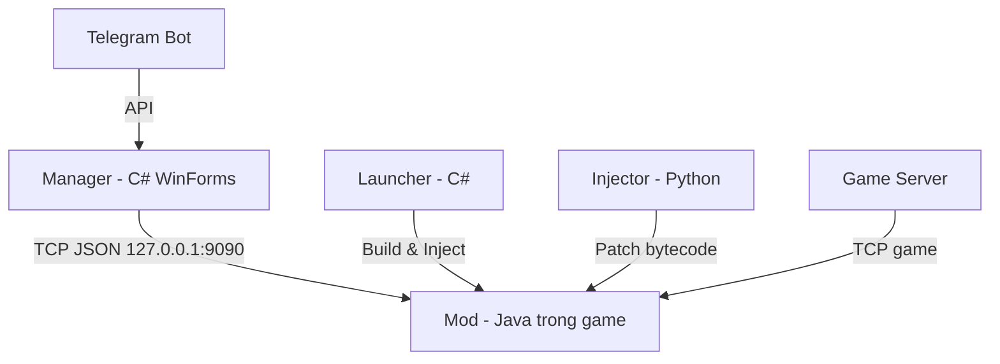
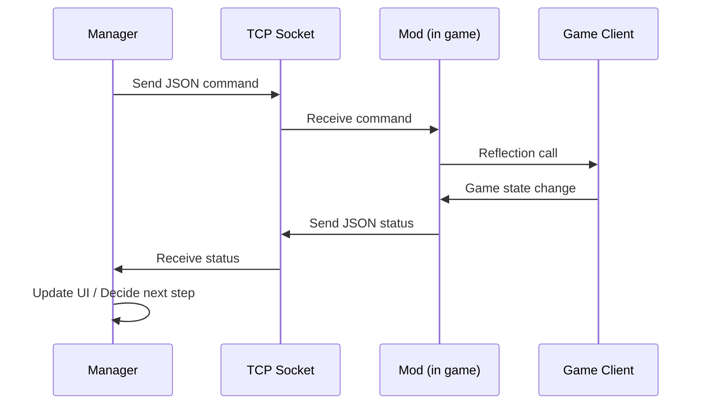
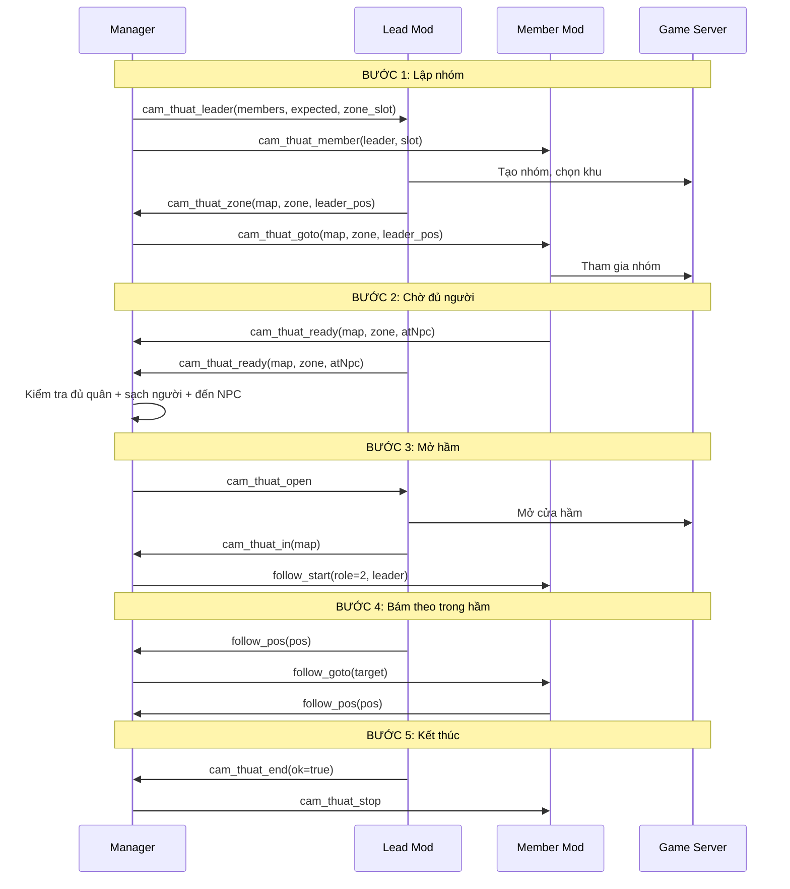

# Phân Tích Công Cụ Game Làng Lá - Auto Bot Tool

> **Ngày phân tích:** 2026-08-13  
> **Phiên bản:** Auto Bot Tool v2.0  
> **Mục đích:** Tài liệu phân tích toàn diện cách hoạt động của công cụ tự động hoá game Làng Lá

---

## 1. Kiến Trúc Tổng Quan

### 1.1 Các Thành Phần Chính

Công cụ này là một hệ thống **điều khiển đa tài khoản** cho game Làng Lá, gồm bốn thành phần chính:



| Thành phần | Ngôn ngữ | Vai trò |
|---|---|---|
| **Manager** | C# (.NET 8, WinForms) | Bảng điều khiển trung tâm, TCP server, UI |
| **Mod** | Java (trong game client) | Chạy bên trong game, thao tác qua Reflection |
| **Launcher** | C# (.NET 8) | Công cụ build và khởi chạy |
| **Injector** | Python 3 | Biên dịch và patch bytecode Java |

### 1.2 Luồng Hoạt Động

1. **Injector** biên dịch mod Java và patch vào `client_modded.jar`
2. **Manager** khởi động TCP server trên cổng 9090
3. **Manager** khởi chạy nhiều game client, mỗi client nhận JVM properties chứa thông tin tài khoản
4. **Mod** trong game kết nối TCP tới Manager
5. **Manager** và **Mod** giao tiếp qua giao thức JSON qua TCP

---

## 2. Cơ Chế Build & Inject

### 2.1 Injector (inject.py)

File: `Injector/inject.py`

#### Quy trình:
1. **Tải thư viện**: Tự động tải `javassist` (thư viện bytecode manipulation) và `ecj` (Eclipse Compiler for Java)
2. **Biên dịch mod Java**: Sử dụng `ecj` + JRE 1.8 của game để biên dịch `Auto.java` và `TaskManager.java`
3. **Patch bytecode**: Dùng `javassist` sửa đổi class `a.a` (game main class):
   - Ghi đè phương thức `render()` để gọi `Auto.tick()` mỗi frame
   - Thêm lớp `com.mybot.*` vào trong `client_modded.jar`
4. **Đóng gói**: Tạo lại `client_modded.jar` với mod đã được inject

#### Điểm nhấn kỹ thuật:
- **Không cần JDK**: Chỉ cần JRE 1.8 của game + `ecj`
- **Idempotent**: Script vừa đọc vừa ghi đè lên chính `client_modded.jar`
- **Xử lý file lock**: Retry 5 lần nếu file bị khóa, nếu vẫn lỗi sẽ tạo file `_new.jar`

### 2.2 Injector.java (được sinh tự động)

```java
// Hook vào a.a.render() - gọi Auto.tick() mỗi frame
public void render() {
    com.mybot.Auto.tick();
    super.render();
}
```

**Lưu ý quan trọng**: Không inject vào `create()` vì sẽ gây cộng dồn lời gọi. `render()` được xóa và thêm lại mỗi lần build nên không bao giờ cộng dồn.

---

## 3. Giao Thức TCP JSON

### 3.1 Kết nối

- **Địa chỉ**: `127.0.0.1:9090`
- **Định dạng**: Mỗi dòng một gói JSON, UTF-8, kết thúc bằng `\n`
- **Chiều**: Hai chiều (Manager → Mod và Mod → Manager)

### 3.2 Manager → Mod (Lệnh i)

#### Lệnh cơ bản
```json
{"command":"start_auto"}
{"command":"stop_auto"}
{"command":"start_task"}
{"command":"stop_task"}
```

#### Cấu hình AFK
```json
{"command":"set_afk_map","map":74,"zone":1}
{"command":"change_zone_now","zone":21}
```

#### Điều khiển nhân vật
```json
{"command":"get_pos"}
{"command":"go_village"}
{"command":"go_exit","map":-1}
```

#### Hoạt động theo nhóm - Cấm thuật (Cam thuật)
```json
{"command":"cam_thuat_leader","members":"char1;char2","expected":3,"zone_slot":0,"zone_slots":1}
{"command":"cam_thuat_member","leader":"char1","slot":0}
{"command":"cam_thuat_goto","map":74,"zone":1,"x":500,"y":500,"leader":"char1"}
{"command":"cam_thuat_open"}
{"command":"cam_thuat_stop"}
{"command":"cam_thuat_zone_full","who":"char2","want_zone":21}
```

#### Hoạt động theo nhóm - Sơn cáp
```json
{"command":"son_cap_leader","members":"char1;char2","expected":3,"zone_slot":0,"zone_slots":1}
{"command":"son_cap_member","leader":"char1","slot":0}
{"command":"son_cap_goto","map":74,"zone":1,"x":500,"y":500,"leader":"char1"}
{"command":"son_cap_enter"}
{"command":"son_cap_stop"}
{"command":"son_cap_zone_full","who":"char2","want_zone":21}
```

#### Hoạt động theo nhóm - Ải gia tộc (AGT)
```json
{"command":"agt_start","role":1}
{"command":"agt_go"}
{"command":"agt_stop"}
```

#### Bám theo (Follow)
```json
{"command":"follow_start","role":2,"leader":"char1","move":-1,"owner":"cam_thuat"}
{"command":"follow_goto","map":74,"zone":1,"x":500,"y":500,"tx":-1,"ty":-1,"tid":-1}
{"command":"follow_stop"}
```

#### Địa cung (Dia cung)
```json
{"command":"dia_cung_run","tier":1,"skipKey":false}
```

#### Đại hội nhẫn giả (Dai hoi)
```json
{"command":"dai_hoi_run"}
{"command":"dai_hoi_stop"}
```

#### Bùa uế thổ (Captcha)
```json
{"command":"bua_ma","ma":"ABC123"}
```

#### Gom đồ (Gom do)
```json
{"command":"gom_lead_start"}
{"command":"gom_lead_report"}
{"command":"gom_mem_start","map":74,"zone":1,"x":500,"y":500,"lead":"char1"}
{"command":"gom_invite","who":"char2"}
{"command":"gom_zone_hop"}
{"command":"gom_stop","xong":1}
```

#### Đổi tinh thạch (Tinh thach)
```json
{"command":"tinh_thach_start"}
{"command":"tinh_thach_stop"}
```

#### Soi map (Scan)
```json
{"command":"map_scan"}
{"command":"scan_auto","on":1}
{"command":"scan_npc"}
{"command":"deep_scan"}
{"command":"search_npc","keyword":"NPC Name"}
{"command":"search_hp","hp":1000}
```

#### Xuất danh sách vật phẩm
```json
{"command":"item_list"}
```

### 3.3 Mod → Manager (Báo cáo t)

#### Trạng thái chung (gửi mỗi 1.5s)
```json
{
    "username":"nick_01",
    "status":"Dang Auto",
    "level":120,
    "charName":"Kiếm",
    "hp":"5000/5000",
    "quest":"Đang chờ...",
    "task":"Cấm thuật: đang lập nhóm"
}
```

#### Thông tin vị trí
```json
{"type":"pos_info","x":500,"y":500,"map":74,"username":"nick_01"}
```

#### Địa cung
```json
{"type":"dia_cung","ok":true,"detail":"Hoàn thành","username":"nick_01"}
{"type":"dia_cung_key_claimed","username":"nick_01"}
{"type":"dia_cung_key_reset","username":"nick_01","detail":"Không vào được hầm"}
{"type":"dia_cung_progress","username":"nick_01","detail":"Đang tạo nhóm..."}
```

#### Cấm thuật
```json
{"type":"cam_thuat_zone","map":74,"zone":1,"extra":"char1","x":500,"y":500,"username":"nick_01"}
{"type":"cam_thuat_roster","map":74,"zone":1,"have":"char1;char2","missing":"char3","strangers":"","username":"nick_01"}
{"type":"cam_thuat_zone_full","who":"char2","want_zone":21,"username":"nick_01"}
{"type":"cam_thuat_ready","map":74,"zone":1,"extra":"leader","x":500,"y":500,"atNpc":true,"username":"nick_01"}
{"type":"cam_thuat_turn","detail":"Xong lượt 1","username":"nick_01"}
{"type":"cam_thuat_dry","detail":"Chạy nháp, dừng trước bấm","username":"nick_01"}
{"type":"cam_thuat_in","map":74,"username":"nick_01"}
{"type":"cam_thuat_out","username":"nick_01"}
{"type":"cam_thuat_progress","detail":"Đang di chuyển tới NPC...","username":"nick_01"}
{"type":"cam_thuat_group","ok":true,"detail":"Đã vào nhóm","extra":"member","username":"nick_01"}
{"type":"cam_thuat_end","ok":true,"detail":"Hoàn thành","extra":"leader","username":"nick_01"}
```

#### Sơn cáp
```json
{"type":"son_cap_zone","map":74,"zone":1,"extra":"char1","x":500,"y":500,"username":"nick_01"}
{"type":"son_cap_ready","map":74,"zone":1,"ok":true,"x":500,"y":500,"username":"nick_01"}
{"type":"son_cap_end","ok":true,"detail":"Hoàn thành","extra":"leader","username":"nick_01"}
{"type":"son_cap_progress","detail":"Đang lên tầng...","username":"nick_01"}
{"type":"son_cap_dry","detail":"Chạy nháp","username":"nick_01"}
{"type":"son_cap_zone_full","who":"char2","want_zone":21,"username":"nick_01"}
{"type":"son_cap_in","map":74,"username":"nick_01"}
{"type":"son_cap_out","username":"nick_01"}
```

#### Ải gia tộc
```json
{"type":"agt_opened","detail":"Đã mở cửa ải","username":"nick_01"}
{"type":"agt_dry","detail":"Chạy nháp","username":"nick_01"}
{"type":"agt_in_gate","map":74,"username":"nick_01"}
{"type":"agt_end","ok":true,"detail":"Hoàn thành","username":"nick_01"}
```

#### Bám theo
```json
{"type":"follow_pos","map":74,"zone":1,"x":500,"y":500,"role":"member","detail":"Đang bám theo","tx":-1,"ty":-1,"tid":-1,"username":"nick_01"}
```

#### Bùa uế thổ
```json
{"type":"bua_ue_tho","detail":"Bị kẹt captcha","anh":"base64_image_data","username":"nick_01"}
{"type":"bua_ue_tho_het","detail":"Đã giải captcha","username":"nick_01"}
{"type":"bua_ue_tho_nhap","detail":"Đã nhập mã captcha","username":"nick_01"}
{"type":"bua_ue_tho_sai","detail":"Mã sai","username":"nick_01"}
{"type":"bua_ue_tho_bo","detail":"Bỏ qua captcha","username":"nick_01"}
```

#### Nhiệm vụ hàng ngày
```json
{"type":"auto_nv_end","detail":"Đã hoàn thành nhiệm vụ ngày","username":"nick_01"}
```

#### Đổi tinh thạch
```json
{"type":"tinh_thach_end","ok":true,"detail":"Đã đổi xong","username":"nick_01"}
```

#### Gom đồ
```json
{"type":"gom_lead_at","map":74,"zone":1,"x":500,"y":500,"lead":"char1","username":"nick_01"}
{"type":"gom_mem_ready","detail":"Đã tới chỗ lead","username":"nick_01"}
{"type":"gom_mem_con","detail":"Còn đồ để giao","username":"nick_01"}
{"type":"gom_mem_done","detail":"Đã giao xong","mon":"Mảnh huyết","username":"nick_01"}
{"type":"gom_loi","detail":"Lỗi giao dịch","username":"nick_01"}
{"type":"gom_zone_full","detail":"Khu đầy, đổi khu","username":"nick_01"}
{"type":"gom_lead_luot","detail":"Xong lượt 1","username":"nick_01"}
```

#### Soi map
```json
{"type":"map_scan","detail":"...","auto":false,"username":"nick_01"}
{"type":"scan_npc_result","npcs":[...],"mobs":[...],"username":"nick_01"}
{"type":"deep_scan_result","data":{...},"username":"nick_01"}
{"type":"search_npc_result","data":{...},"username":"nick_01"}
{"type":"search_hp_result","data":{...},"username":"nick_01"}
```

#### Danh sách vật phẩm
```json
{"type":"item_list","detail":"=== HET BANG ===","username":"nick_01"}
```

#### Thử đi qua map
```json
{"type":"go_exit","ok":true,"detail":"Đã qua map thành công","username":"nick_01"}
```

---

## 4. Cơ Chế Tương Tác Với Game

### 4.1 Reflection - Truy cập class obfuscated

Mod sử dụng Java Reflection để truy cập các class game đã được obfuscate:

| Class thực | Tên obfuscated | Vai trò |
|---|---|---|
| `com.badlogic.gdx.Game` | `a.a` | Game main class |
| `LoginManager` | `a.fj` | Quản lý đăng nhập |
| `GameData` | `a.n` | Dữ liệu game |
| `PlayerData` | `a.i` | Dữ liệu nhân vật |
| `NetworkManager` | `a.fC` | Kết nối mạng |
| `PacketManager` | `a.fm` | Quản lý gói tin |
| `ScreenManager` | `a.fk` | Quản lý màn hình |
| `DialogPanel` | `a.bd` | Panel dialog |
| `Button` | `a.be` | Nút bấm |

### 4.2 Cơ chế đăng nhập tự động

1. **Chọn server**: Gán server đúng vào `a.n.a().b` trước khi login
2. **Gọi `fj.Q()`**: Set server IP/port
3. **Set username**: Gọi `fj.c(String)` để set username
4. **Set password**: Truy cập trực tiếp field `fY` và gọi `c(String)`
5. **Kiểm tra internet**: Gọi `fM.w()` 
6. **Trigger login**: Gọi `fj.h()` để bắt đầu đăng nhập

### 4.3 Xử lý popup đăng nhập

**BƯỚC 1 - Chẩn đoán (read-only)**:
- Dump toàn bộ trạng thái popup
- Tìm class popup, text "Cập nhật dữ liệu..."
- Phân tích cấu trúc panel và nút

**BƯỚC 2 - Tự động đóng**:
- Tìm panel có đúng 1 nút (popup xác nhận đơn)
- Gọi `panel.b(cmd, data, button)` - đúng thứ `by.l()` làm khi nhấn
- Chỉ thực hiện khi đang treo pre-login và có popup

### 4.4 Tick-based game loop

```java
public static void tick() {
    // 1. Khởi tạo (sau 3s)
    if (!initialized) init();
    
    // 2. Khởi tạo Reflection (sau 3s, throttle 2s)
    if (!reflectionInitialized && elapsed > 3000) {
        initReflection();
    }
    
    // 3. Auto login (sau 5s)
    if (reflectionInitialized && !loginSuccess && elapsed > 5000) {
        attemptAutoLogin();
    }
    
    // 4. Tự động đóng popup (sau 3s, mỗi 1s)
    if (!loginSuccess && loginManager == null && elapsed > 3000) {
        tryDismissUpdatePopup();
    }
    
    // 5. Chẩn đoán popup (sau 9s, tối đa 3 lần)
    if (!loginSuccess && elapsed > 9000) {
        dumpLoginPopupState();
    }
    
    // 6. Vào game (sau 8s)
    if (loginSuccess && !enterGameAttempted && elapsed > 8000) {
        // Gửi packet CMD -122, sub-command -127, charIndex 0
    }
    
    // 7. Đọc dữ liệu game (sau 10s)
    if (elapsed > 10000) {
        readGameData();
    }
    
    // 8. Đọc lệnh TCP (non-blocking)
    if (isConnected && socket != null && elapsed > 5000) {
        // Đọc InputStream.available()
    }
    
    // 9. Chạy TaskManager (sau 15s)
    if (elapsed > 15000) {
        TaskManager.getInstance().tick();
    }
    
    // 10. Gửi trạng thái về Manager (mỗi 1.5s)
    if (isConnected && (now - lastStatusSendTime > 1500)) {
        sendStatusToManager();
    }
}
```

---

## 5. Các Chức Năng Chính Của Tool

### 5.1 Quản lý tài khoản (Manager)

#### Thêm/xóa tài khoản
- Thêm tài khoản qua form nhập username/password/server
- Lưu vào `config.json` (được gitignore)
- Hỗ trợ nhiều tài khoản cùng lúc

#### Khởi chạy game
- **Tuần tự**: Chờ từng nick login xong mới chạy nick tiếp theo
- **Tự động retry**: Nếu client kẹt ở màn hình đăng nhập, tự động tắt và chạy lại
- **Kiểm tra trần số client**: Không mở quá `max_client` (mặc định 12)

#### Theo dõi trạng thái
- Hiển thị trạng thái từng nick: đang chờ login, đã login, đang auto, lỗi...
- Cột màu sắc: đỏ = mất kết nối, trắng = bình thường
- Cập nhật real-time qua TCP

### 5.2 Auto NV hàng ngày (Nhiệm vụ)

#### Chức năng
- Tự động hoàn thành nhiệm vụ hàng ngày
- Tự động nhận thưởng

#### Cơ chế
- `start_auto` / `stop_auto`: Bật/tắt toàn bộ auto
- `start_task` / `stop_task`: Bật/tắt chỉ auto nhiệm vụ
- TaskManager quản lý state machine: `IDLE → MOVE_TO_NPC → INTERACT_NPC → ...`

### 5.3 Cấm thuật (Cam thuật) - Boss Hunt

#### Mô tả
Hoạt động theo nhóm, mỗi nhóm 3-6 người, mỗi ngày chạy 3 lượt.

#### Cơ chế
1. **Manager tạo nhóm**: Gửi `cam_thuat_leader` cho trưởng nhóm, `cam_thuat_member` cho thành viên
2. **Trưởng nhóm lập nhóm**: Tạo nhóm trong game, chọn khu
3. **Báo vị trí**: Trưởng nhóm gửi `cam_thuat_zone` → Manager chuyển tiếp cho member
4. **Member theo dõi**: Nhận `cam_thuat_goto` để di chuyển tới trưởng nhóm
5. **Chờ đủ người**: Manager kiểm tra `cam_thuat_ready` từ tất cả thành viên
6. **Mở hầm**: Khi đủ điều kiện, Manager gửi `cam_thuat_open` cho trưởng nhóm
7. **Bám theo**: Bật chế độ follow trong hầm
8. **Kết thúc**: Trưởng nhóm báo `cam_thuat_end` → Manager báo member dừng

#### Cổng chặn (Manager)
- **Đủ quân**: Tất cả thành viên phải ở cùng map/khu
- **Sạch người**: Không có người lạ trong nhóm
- **Đến NPC**: Tất cả phải đứng sát NPC

### 5.4 Sơn cáp (Son cap) - Myoboku

#### Mô tả
Hoạt động theo nhóm, mỗi nhóm 6 người, mỗi ngày 1 lượt.

#### Cơ chế
1. **Lập nhóm**: Tương tự Cấm thuật nhưng có cấu trúc 5 tầng
2. **Tập kết**: Cả nhóm tập trung ở NPC Fukasaku
3. **Vào ải**: Trưởng nhóm bấm NPC → cả nhóm vào
4. **Dồn hoả lực**: Mỗi tầng, lead làm trưởng nhóm, member bám theo
5. **Chuyển tầng**: Dựa trên map đổi để xác định tầng mới

#### Đặc điểm
- **MỐC "SANG TẦNG MỚI"**: Dựa trên map thay đổi, không phải thời gian
- **Chốt phiên**: Trưởng nhóm báo kết thúc → member dừng ngay

### 5.5 Ải gia tộc (AGT) - Clan Dungeon

#### Mô tả
Hoạt động theo gia tộc, một nick mở cửa, phần còn lại vào.

#### Cơ chế
1. **Mở cửa**: Nick được khai `mo_cua` gửi `agt_start` với role=1
2. **Vào ải**: Các nick khác gửi `agt_start` với role=2
3. **Đợi mở**: Manager chờ `agt_opened` từ nick mở cửa
4. **Phát tín hiệu**: Gửi `agt_go` cho tất cả member
5. **Bám theo**: Trong ải, nick đầu tiên vào làm lead, các nick khác bám theo

### 5.6 Địa cung (Dia cung) - Daily Dungeon

#### Mô tả
Hoạt động đơn, mỗi nick tự chạy, không cần nhóm.

#### Cơ chế
1. **Tạo nhóm**: Tự động tạo nhóm 1 người
2. **Nhận chìa**: Nhận chìa khóa tại NPC
3. **Vào hầm**: Tự động vào hầm tương ứng với tier
4. **Hoàn thành**: Hoàn thành hầm và nhận thưởng

#### Tính năng đặc biệt
- **Theo dõi ngày**: Lưu `DiaCungKeyDate` để tránh nhận chìa hai lần
- **Tier tùy chỉnh**: Mỗi nick có thể cài đặt tier riêng (1-4)

### 5.7 Gom đồ (Gom do) - Item Transfer

#### Mô tả
Chuyển đồ từ nhiều nick về một nick lead.

#### Cơ chế
1. **Cả đội về làng**: Gửi `go_village` cho tất cả member
2. **Lead khởi động**: Gửi `gom_lead_start` cho lead
3. **Hàng đợi**: Manager duy trì hàng đợi, chỉ cho một mem giao đồ tại một thời điểm
4. **Phát điểm hẹn**: Lead báo vị trí → Manager gửi cho mem đang lượt
5. **Giao dịch**: Mem tới chỗ lead, gửi `gom_mem_ready` → lead mời giao dịch
6. **Hoàn thành**: Mem báo `gom_mem_done` → chuyển sang mem kế tiếp

#### Ràng buộc
- **Một mem một lúc**: Cửa sổ giao dịch chỉ nhận một đối phương
- **Điểm hẹn**: Lead phải ở trong game và báo vị trí trước khi gửi cho mem

### 5.8 Đổi tinh thạch (Tinh thach) - Crystal Exchange

#### Mô tả
Mỗi nick tự chạy, không cần nhóm.

#### Cơ chế
1. **Tự động**: Mỗi nick tự đi tới NPC Kinkaku ở Làng Cỏ
2. **Đổi hết**: Đổi hết trang bị có thể đổi được (16 ô một lượt)
3. **Lặp lại**: Lặp tới khi hết đồ

#### Đặc điểm
- **Song song**: 12 nick chạy độc lập, không ảnh hưởng nhau
- **Tự động**: Game tính sẵn món nào đổi được bao nhiêu tinh thạch

### 5.9 Bùa uế thổ (Captcha) - Bua ue tho

#### Mô tả
Xử lý tình huống bị người khác kẹt bùa uế thổ.

#### Cơ chế
1. **Phát hiện**: Mod gửi ảnh captcha base64 về Manager
2. **Đẩy lên Telegram**: Manager gửi ảnh lên Telegram với caption hướng dẫn
3. **Người dùng reply**: Reply mã vào tin ảnh
4. **Chuyển xuống**: Manager chuyển mã về client qua TCP
5. **Tự động nhập**: Mod tự động gõ mã vào ô captcha

#### Tính năng đặc biệt
- **Không giải ảnh**: Tool chỉ chuyển ảnh cho người thật xem
- **Reply lại được**: Nếu gõ sai, game giữ nguyên mã cũ → reply tiếp vào cùng tin
- **Timeout 24h**: Mục chờ tự động dọn sau 24 giờ

### 5.10 Soi map (Scan) - Map scanning

#### Các chức năng
1. **Scan NPC**: Liệt kê tất cả NPC và mob trong vùng
2. **Deep scan**: Quét sâu tất cả entity vectors
3. **Search NPC**: Tìm NPC theo từ khóa
4. **Search HP**: Tìm entity có HP lớn
5. **Scan tự động**: Soi liên tục theo nhịp `scan_auto_ms`

#### Đặc điểm
- **Thuần đọc bộ nhớ**: Không gửi gói nào lên server
- **Ghi file**: Kết quả ghi ra file `soi_map_<thời gian>.log`
- **Không ảnh hưởng**: Chạy song song với bất kỳ hoạt động nào

### 5.11 Danh sách vật phẩm (Item list)

#### Mô tả
Xuất bảng mẫu vật phẩm của game ra file.

#### Cơ chức
- Đọc toàn bộ danh sách vật phẩm từ bộ nhớ game
- Ghi ra file `danh_sach_vat_pham_<thời gian>.log`
- Dùng để tra mã khi thêm món mới vào danh sách gom

### 5.12 Thử đi qua map (Go exit)

#### Mô tả
Thử chuyển map bằng cách đi tới tấm biển.

#### Cơ chức
- Đọc bảng lối ra của map (`z.K`)
- Đi tới tấm biển chỉ đường
- Tự động chọn lối bên phải nếu không chỉ định

### 5.13 Bám theo (Follow) - Manual follow

#### Mô tả
Chế độ bám theo thủ công, dùng để kiểm tra.

#### Cơ chức
- Nick đầu tiên tick làm lead
- Các nick còn lại bám theo lead
- Có hai chế độ: `move=1` (tự đi tới) và `move=0` (chỉ gán mục tiêu)

---

## 6. Cơ Chế Đồng Bộ & Bảo Vệ

### 6.1 Nguyên tắc "Bằng chứng, không phải đồng hồ"

> Không bước nào chuyển tiếp bằng `sleep(5s)` rồi coi như xong. Mỗi bước chờ một BÁO CÁO cụ thể từ client.

**Ví dụ**:
- Chờ login → chờ `level > 0 && charName != "" && maxHp > 0`
- Chờ vào hầm → chờ `cam_thuat_in` từ tất cả thành viên
- Chờ đủ nhóm → chờ `cam_thuat_ready` từ tất cả thành viên

### 6.2 Nguyên tắc "Một cửa ra duy nhất"

> Mọi đường kết thúc của một hoạt động đều đi qua đúng một hàm.

**Ví dụ**:
- `stopAllActivities()` trong TaskManager dừng tất cả hoạt động
- `stopCurrentActivity()` dừng hoạt động hiện tại và dọn dẹp trạng thái

### 6.3 Cơ chế chống cộng dồn

- `init()` có cờ `initialized` để tránh gọi nhiều lần
- `render()` được xóa và thêm lại mỗi lần build (không cộng dồn như `create()`)
- Mỗi lần build chỉ có một lời gọi `Auto.tick()` duy nhất

### 6.4 Xử lý lỗi và timeout

- **Login retry**: Tối đa 5 lần thử, mỗi lần chờ 120s
- **File lock**: Retry 5 lần khi ghi `client_modded.jar`
- **Socket timeout**: Tự động ngắt kết nối nếu không hoạt động

---

## 7. Cấu Hình

### 7.1 config.json

```json
{
  "Username": "default_user",
  "Password": "default_pass",
  "Server": "Server 1",
  "GamePath": "C:\\Games\\LangLa",
  "HideConsole": true,
  "AfkMapId": 74,
  "AfkZone": 1,
  "Accounts": [
    {
      "Username": "nick_01",
      "Password": "pass01",
      "Server": "Server 1",
      "AfkMapId": 74,
      "AfkZone": 1,
      "DiaCungKeyDate": "2026-08-13",
      "DiaCungTier": 3
    }
  ]
}
```

### 7.2 doi_hinh.cfg

```ini
[chung]
max_client = 12
login_thu_lai = 2
login_cho_giay = 120

[team:1]
nick_01
nick_02

[camthuat:CT-1]
truong = nick_01
nick_02
nick_03

[soncap:SC-1]
truong = nick_04
nick_05
nick_06

[agt]
mo_cua = nick_07

[gom]
nhan_do = nick_01
```

### 7.3 quest_anchors.cfg

Chứa cấu hình toạ độ NPC, map, và các thông số khác cho từng hoạt động.

### 7.4 telegram.cfg

```ini
token = 123456:ABC-DEF
chat_id = 123456789
bat = 1
bang_trang_thai = 1
bang_giay = 20
tin_giao_dich = 1
tin_loi = 1
```

---

## 8. Cách Tương Tác Chính Xác Với Game Qua TCP Proxy

### 8.1 Tại sao TCP proxy lại hiệu quả?

1. **Trực tiếp với game client**: Mod chạy bên trong game client (được inject vào JVM), có thể truy cập trực tiếp vào bộ nhớ game thông qua Reflection
2. **Không cần hack server**: Tất cả thao tác đều thực hiện ở phía client, server không biết
3. **Đồng bộ thực sự**: TCP cung cấp kết nối tin cậy, đảm bảo không mất lệnh
4. **Giao thức đơn giản**: JSON dòng - dễ parse, dễ debug, không cần framing phức tạp

### 8.2 Cơ chế đồng bộ hai chiều



### 8.3 Đảm bảo độ chính xác

1. **Event-driven**: Manager không đưa ra lệnh dựa trên thời gian mà dựa trên sự kiện từ client
2. **State machine**: TaskManager sử dụng state machine để quản lý trạng thái
3. **Cổng chặn**: Manager có các cổng chặn (cổng chặn) để đảm bảo đủ điều kiện mới thực hiện bước tiếp
4. **Báo cáo thực**: Mọi quyết định đều dựa trên báo cáo thực từ game, không phải dự đoán

### 8.4 Ví dụ: Chu trình Cấm thuật chi tiết



### 8.5 Cơ chế bảo vệ đặc biệt

#### Chống cộng dồn lệnh
- `init()` có cờ `initialized`
- `render()` được xóa và thêm lại mỗi lần build

#### Xử lý popup đăng nhập
- **BƯỚC 1**: Chẩn đoán (read-only, dump toàn bộ trạng thái)
- **BƯỚC 2**: Tự động đóng (chỉ khi có đúng 1 nút)

#### Chọn server chính xác
- Manager ghi `arr_server.beatdz` với IP:port đúng
- Mod dùng Reflection chọn server trong danh sách client

#### Xử lý bùa uế thổ
- Chuyển ảnh captcha lên Telegram
- Người dùng reply mã → Manager chuyển xuống client
- Không tự giải ảnh, chỉ làm bàn phím nối dài

---

## 9. Cấu Trúc File

```
langlatool/
├── build_run.bat              # Script build & chạy
├── config.json                # Cấu hình tài khoản (gitignore)
├── config.mau.json            # File mẫu cấu hình
├── doi_hinh.cfg               # Cấu hình đội hình
├── quest_anchors.cfg          # Cấu hình toạ độ NPC/map
├── telegram.cfg               # Cấu hình Telegram (gitignore)
├── README.md                  # Tài liệu dự án
├── HUONG_DAN_SETUP.md         # Hướng dẫn cài đặt
├── launcher.settings.json     # Cài đặt launcher
├── client_modded.jar          # Game client đã được mod (không có trong repo)
├── Injector/
│   ├── inject.py              # Script inject Python
│   ├── Injector.java          # Lớp inject Java (được sinh tự động)
│   └── classes/               # Thư mục biên dịch
├── Launcher/
│   ├── LangLaTool.csproj      # Project file
│   ├── LauncherForm.cs        # Form launcher
│   └── Program.cs             # Entry point
├── Manager/
│   ├── Manager.csproj         # Project file
│   ├── Form1.cs               # Form chính
│   ├── Form1.Designer.cs      # Designer
│   ├── Form1.TheoDoi.cs       # Theo dõi trạng thái
│   ├── Program.cs             # Entry point
│   ├── Telegram.cs            # Cấu hình Telegram
│   └── bin/Release/           # Thư mục build
├── Mod/
│   ├── src/com/mybot/
│   │   ├── Auto.java          # Lớp chính của mod
│   │   └── TaskManager.java   # Quản lý nhiệm vụ
│   └── classes/               # Thư mục biên dịch
├── lib/                       # Thư viện (javassist.jar)
├── temp_patched/              # Thư mục tạm cho bytecode
└── tools/                     # Công cụ (ecj.jar)
```

---

## 10. Các Lớp và Giao Diện Chính

### 10.1 Manager (C#)

#### Form1.cs
- **TcpListener**: TCP server trên cổng 9090
- **ClientSession**: Quản lý kết nối TCP từng client
- **AppConfig**: Cấu hình tài khoản
- **ServerInfo**: Thông tin server game
- **GroupSetup**: Cấu hình nhóm
- **GroupRoster**: Đội hình thực của nhóm

#### Form1.TheoDoi.cs
- **TrangThaiNick**: Trạng thái theo dõi của một nick
- **TelegramBot**: Tích hợp Telegram
- **TheoDoi()**: Hàm nhận mọi gói từ client

### 10.2 Mod (Java)

#### Auto.java
- **init()**: Khởi tạo kết nối TCP
- **tick()**: Game loop chính
- **connectServer()**: Kết nối TCP tới Manager
- **processCommand()**: Xử lý lệnh từ Manager
- **sendStatusToManager()**: Gửi trạng thái về Manager
- **attemptAutoLogin()**: Đăng nhập tự động
- **initReflection()**: Khởi tạo Reflection
- **readGameData()**: Đọc dữ liệu game

#### TaskManager.java
- **State machine**: IDLE → MOVE_TO_NPC → INTERACT_NPC → ...
- **tick()**: Game loop của task manager
- **setEnabled()**: Bật/tắt auto
- **stopAllActivities()**: Dừng tất cả hoạt động

---

## 11. Những Điểm Đặc Biệt Cần Lưu Ý

### 11.1 Tên nhân vật vs tài khoản
- **Tài khoản**: Tên đăng nhập (username)
- **Nhân vật**: Tên trong game (charName)
- Manager tự động chuyển đổi qua bảng `_charNames`

### 11.2 Server selection
- Manager ghi `arr_server.beatdz` với IP:port đúng
- Mod chọn server trong danh sách client trước khi login
- Tránh login nhầm server test

### 11.3 Timeout và retry
- Login: 5 lần thử, mỗi lần 120s
- TCP connect: 10 lần thử, mỗi lần 3s
- File lock: 5 lần retry

### 11.4 Xử lý đa luồng
- TCP listener chạy trên thread riêng
- Game tick chạy trên thread render
- UI cập nhật qua `SynchronizationContext`

### 11.5 Bảo mật
- `config.json` chứa mật khẩu → được gitignore
- `telegram.cfg` chứa token bot → được gitignore
- Token bot là bí mật → không chia sẻ

---

## 12. Kết Luận

Công cụ này là một hệ thống tự động hoá phức tạp cho game Làng Lá với kiến trúc:

1. **Mô hình client-server**: Manager (server) + Mod (client trong game)
2. **Giao tiếp TCP JSON**: Đơn giản, tin cậy, dễ debug
3. **Reflection**: Truy cập trực tiếp bộ nhớ game mà không cần hack server
4. **Event-driven**: Đồng bộ thực sự thông qua báo cáo từ client
5. **State machine**: Quản lý trạng thái phức tạp của từng hoạt động
6. **Cổng chặn**: Đảm bảo đủ điều kiện mới thực hiện bước tiếp

Sự kết hợp giữa **Reflection** (truy cập game) và **TCP proxy** (giao tiếp với Manager) tạo ra một hệ thống mạnh mẽ, linh hoạt và có khả năng mở rộng cao. Manager đóng vai trò trung tâm điều phối, trong khi Mod chịu trách nhiệm thực thi các hành động trong game và báo cáo trạng thái thực.