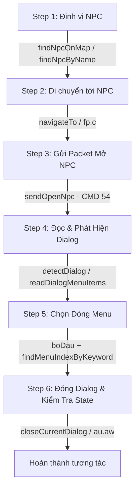

# SYSTEM_MAP - ANTHOLOGY OF SYSTEM ARCHITECTURE & CODEBASE REFERENCE

Tài liệu đặc tả kiến trúc kỹ thuật toàn bộ hệ thống Tool Automation (Java Mod & C# Manager).

---

## 1. SƠ ĐỒ LỚP GIAO DIỆN (UI & Dialog Engine)

### 1.1 Danh sách Class & Field Quản Lý Giao Diện (Obfuscated UI Engine)

| Tầng / Vai trò | Class/Field Thật | Kiểu Dữ Liệu | Nhiệm Vụ Runtime | Điểm Khởi Tạo / Sử Dụng |
|---|---|---|---|---|
| **Root Game Data** | `a.n.a()` | Method static | Lấy singleton game data `a.n` | `Auto.dumpPanelStack()`, `Auto.tryDismissUpdatePopup()` |
| **Screen Manager** | `a.n.a` | `a.fk` | Quản lý màn hình & danh sách panel/dialog | `Auto.fieldByNameType(nInst, "a", Class.forName("a.fk"))` |
| **Panel Stack** | `a.fk.an` | `java.util.Vector<Object>` | Chồng panel/dialog đang mở | `Auto.dumpPanelStack()`, `TaskManager.detectDialog()` |
| **Panel Item Base** | `a.bd` | Class base | Lớp cha của mọi Panel/Dialog UI | `a.cg` (NPC Dialog), `a.cd` (Popup/Confirm) |
| **Button List** | `a.bd.ae` | `java.util.Vector<Object>` | Danh sách các nút (Button) trong Panel | `Auto.dumpPanelStack()`, `Auto.tryDismissUpdatePopup()` |
| **Button Item** | `a.be` / `a.by` | Class base/impl | Đối tượng đại diện cho nút bấm | `Auto.tryDismissUpdatePopup()` |
| **Button Command** | `a.be.ar` / `a.by.ar` | `int` | Mã lệnh (Command ID) khi bấm nút | `getIntUp(bb, "ar", Integer.MIN_VALUE)` |
| **Button Data** | `a.be.e` / `a.by.e` | `Object` | Dữ liệu kèm theo của nút bấm | `getUp(bb, "e")` |
| **Button Parent** | `a.be.c` / `a.by.c` | `a.bd` | Tham chiếu tới Panel chứa nút đó | `fieldByNameType(bb, "c", bdCls)` |
| **Button Click Callback** | `a.bd.b(int, Object, a.be)` | Method (3 args) | Callback thực thi hành động nút bấm | `mb.invoke(parent, cmd, data, bb)` |
| **NPC Dialog** | `a.au` (extends `a.cg`) | Class | Khung thoại tương tác với NPC | `TaskManager.detectDialog()`, `TaskManager.readDialogMenuItems()` |
| **Popup Confirm** | `a.cd` (`a.at` / `a.aT`) | Class | Khung thông báo/xác nhận từ Server | `TaskManager.closeConfirmPopup()`, `TaskManager.readConfirmPopupText()` |

---

### 1.2 Bảng Chứa Nội Dung Hiển Thị Chữ (Text Display Fields)

| Loại Khung UI | Class | Field Thật | Kiểu Dữ Liệu | Nội Dung Chứa | Method Đọc / Xử Lý |
|---|---|---|---|---|---|
| **NPC Menu Items** | `a.au` | `c` | `String[]` | Danh sách dòng lựa chọn NPC (VD: `:-chatSơn Cáp Myoboku`) | `TaskManager.readDialogMenuItems()` |
| **NPC Question Text** | `a.au` | `v` | `java.util.Vector<String>` | Nội dung văn bản câu hỏi / lời thoại NPC | `TaskManager.readDialogQuestionText()` |
| **NPC Dialog Type** | `a.au` | `as` | `int` | Loại dialog (`>=0`: NPC Entity ID, `-2`: OpenMenu) | `TaskManager.detectDialog()` |
| **NPC Parent Index** | `a.au` | `ar` | `int` | Chỉ số menu cha của sub-menu | `TaskManager.readDialogSubMenuIndex()` |
| **Popup Message Text** | `a.cd` / `a.at` / `a.aT` | `w` | `String` | Văn bản thông báo popup (nhắc nhở, báo hết lượt, code FC) | `TaskManager.readConfirmPopupText()` |
| **Quiz / Custom Dialog** | Any Panel in `fk.an` | Field quét động | `String`, `String[]`, `Vector<String>` | Nội dung chữ bất kỳ trong panel để giải đố / lọc tin | `Auto.checkAndReadQuizDialog()` |

---

### 1.3 Phương Thức Giả Lập Bấm Nút & Gửi Lệnh Lựa Chọn (Simulation & Packet Methods)

#### 1. Click Button UI Trực Tiếp (Mod Side)
- **Class:** `a.bd` (hoặc lớp con cụ thể)
- **Method:** `b(int cmd, Object data, a.be button)`
- **Tham số:**
  1. `cmd` (`int`): Mã lệnh của nút lấy từ `button.ar`.
  2. `data` (`Object`): Dữ liệu kèm theo lấy từ `button.e`.
  3. `button` (`a.be`): Instance đối tượng nút bấm.
- **Mã nguồn thực thi (`Auto.java`):**
  ```java
  Method mb = findMethod(parent.getClass(), "b", int.class, Object.class, Class.forName("a.be"));
  mb.invoke(parent, cmd, data, bb);
  ```

#### 2. Gửi Packet Tương Tác NPC Qua Socket Game (TCP Packet Wrapper `a.fm`)
- **Mở NPC (CMD 54):**
  - `TaskManager.sendOpenNpc(int npcId)`
  - **Structure:** `new fm(54)` $\rightarrow$ `writeShort(npcId)` (`fm.t(int)`) $\rightarrow$ `send()` (`fm.aG()`).
- **Chọn Menu Top-Level (CMD 53 - 2 Bytes):**
  - `TaskManager.sendSelectMenu(int npcId, int menuIndex)`
  - **Structure:** `new fm(53)` $\rightarrow$ `writeShort(npcId)` $\rightarrow$ `writeByte(menuIndex)` (`fm.s(int)`) $\rightarrow$ `send()`.
- **Chọn Menu Có Sub-Option (CMD 53 - 3 Bytes):**
  - `TaskManager.sendSelectMenuWithSub(int npcId, int parentIndex, int subIndex)`
  - **Structure:** `new fm(53)` $\rightarrow$ `writeShort(npcId)` $\rightarrow$ `writeByte(parentIndex)` $\rightarrow$ `writeByte(subIndex)` $\rightarrow$ `send()`.
- **Xác Nhận Menu Phụ (CMD 5 - 1 Byte):**
  - `TaskManager.sendSelectSubMenu(int menuIndex)`
  - **Structure:** `new fm(5)` $\rightarrow$ `writeByte(menuIndex)` $\rightarrow$ `send()`.

---

## 2. LUỒNG TƯƠNG TÁC NPC (NPC Interaction Pipeline)

### 2.1 Quy Trình Tương Tác 6 Bước Chi Tiết



### 2.2 Chi Tiết Hàm & Class Chịu Trách Nhiệm

| Bước | Hành Động Kỹ Thuật | Class Chịu Trách Nhiệm | Hàm / Field Thực Thi | Chi Tiết Xử Lý |
|---|---|---|---|---|
| **1. Định vị NPC** | Quét danh sách NPC trên map | `TaskManager`, `a.z`, `a.fr`, `a.fs` | `findNpcOnMap(int npcId)`, `findNpcByName(String name)` | Lấy `zInst.F` (`Vector<a.fr>`), đối chiếu `fr.ah` (template ID) hoặc `fs.l` (tên NPC). |
| **2. Di chuyển** | Tìm đường & di chuyển | `TaskManager`, `a.fp` | `navigateTo(int map, int x, int y)`, `fp.c(int, int, int)` | Đưa nhân vật tới phạm vi `NPC_INTERACT_RANGE = 80`. |
| **3. Mở Khung Thoại** | Gửi packet mở NPC | `TaskManager`, `a.fm` | `sendOpenNpc(int npcId)` | Tạo packet `fm(54)`, ghi `writeShort(npcId)`, gọi `aG()` phát lên server. |
| **4. Phát Hiện & Đọc Menu** | Quét dialog stack | `TaskManager`, `a.fk`, `a.au` | `detectDialog()`, `readDialogMenuItems()` | Đọc stack `fk.an`, lọc đối tượng kiểu `a.au`, trích xuất chuỗi `au.c` (`String[]`). |
| **5. Chuẩn Hóa & Chọn Menu** | Lọc từ khóa tiếng Việt | `TaskManager` | `boDau(String)`, `findMenuIndexByKeyword(String[], String)`, `getSubMenuCount(...)` | Loại bỏ prefix (`:-chat`, `:-?`), chuẩn hóa tiếng Việt bỏ dấu. Gọi `sendSelectMenu` hoặc `sendSelectMenuWithSub`. |
| **6. Đóng & Dọn Màn Hình** | Dọn popup/dialog | `TaskManager`, `a.au`, `a.cd` | `closeCurrentDialog()`, `closeConfirmPopup()`, `closeAnyDialog()` | Gọi `au.aw()` hoặc `cd.aw()` để xóa panel khỏi `fk.an`, tránh kẹt UI cho bước sau. |

---

## 3. VÒNG ĐỜI TASK MANAGER (State Machine Lifecycle)

### 3.1 Luồng Trạng Thái Tác Vụ Tự Động NV (Main `TaskState` Enum)

`TaskManager.java` vận hành một máy trạng thái hữu hạn chính (`TaskState`) cho chuỗi nhiệm vụ Tuần Hoàn và Linh Thú:

```
IDLE ──► MOVE_TO_NPC ──► INTERACT_NPC ──► WAIT_TASK_DATA ──► MOVE_TO_MAP ──► DO_TASK ──► MOVE_TO_TURN_IN ──► TURN_IN ──► COOLDOWN ──► IDLE / AFK_FARM
```

| State Enum | Tick Handler Method | Hành Động Chi Tiết Trong Loop | Điều Kiện Chuyển State (`setState`) |
|---|---|---|---|
| `IDLE` | `tickIdle(long now)` | Kiểm tra giới hạn số lượt (`i.v`, `i.w`), khởi tạo nhiệm vụ mới. | Chuyển `MOVE_TO_NPC` khi có nhiệm vụ khả thi. |
| `MOVE_TO_NPC` | `tickMoveToNpc(long now)` | Di chuyển tới NPC nhận NV (`NPC_TUAN_HOAN=102`, `NPC_LINH_THU=98`). | Đến phạm vi `NPC_INTERACT_RANGE` $\rightarrow$ `INTERACT_NPC`. |
| `INTERACT_NPC` | `tickInteractNpc(long now)` | Gọi `sendOpenNpc`, đọc menu, bấm dòng nhận nhiệm vụ. | Khi gửi packet nhận NV $\rightarrow$ `WAIT_TASK_DATA`. |
| `WAIT_TASK_DATA` | `tickWaitTaskData(long now)` | Chờ Server sync thông tin NV về đối tượng `a.dq` (`z.a` / `z.b`). | `dq` xuất hiện & có data $\rightarrow$ `MOVE_TO_MAP`. Timeout $\rightarrow$ `IDLE`. |
| `MOVE_TO_MAP` | `tickMoveToMap(long now)` | Chuyển map tới bản đồ mục tiêu làm nhiệm vụ (`dq.aY`, `dq.ar`). | Đã tới đúng map $\rightarrow$ `DO_TASK`. |
| `DO_TASK` | `tickDoTask(long now)` | Tìm quái/vật thể, bật auto combat (`fe_0.bo`), đánh quái gom tiến độ. | Check `dq.p() == true` (hoàn thành) $\rightarrow$ `MOVE_TO_TURN_IN`. |
| `MOVE_TO_TURN_IN` | `tickMoveToTurnIn(long now)` | Di chuyển quay trở lại NPC trả nhiệm vụ. | Đến gần NPC $\rightarrow$ `TURN_IN`. |
| `TURN_IN` | `tickTurnIn(long now)` | Mở NPC, chọn dòng trả nhiệm vụ. | Trả xong NV $\rightarrow$ `COOLDOWN`. |
| `COOLDOWN` | `tickCooldown(long now)` | Trễ an toàn `COOLDOWN_MS = 1500ms`. | Hết cooldown $\rightarrow$ `IDLE`. |
| `AFK_FARM` | `tickAfkFarm(long now)` | Tự chuyển sang map AFK farm quái khi hết nhiệm vụ ngày. | Chạy liên tục cho tới khi đổi config/tắt auto. |

---

### 3.2 Các Máy Trạng Thái Hoạt Động Chạy Song Song Trong `tick()`

Ngoài `TaskState`, `TaskManager.java` tích hợp các Sub-State Machines độc lập được kiểm tra trực tiếp mỗi chu kỳ `tick(long now)`:

| Biến Cờ Bước (Step Variable) | Handler Method | Tác Vụ Quản Lý | Phương Thức Dừng / Reset |
|---|---|---|---|
| `dcStep > 0` | `tickDiaCung(long now)` | Tự động đi Địa Cung (Lập nhóm 1 người, tới NPC, nhận chìa, chọn tầng) | `finishDiaCung(...)`, `dcStep = 0` |
| `ctStep > 0` | `tickCamThuat(long now)` | Cấm Thuật (Leader gom đội, unlock, mở NPC; Member đi theo zone) | `stopCamThuat()`, `resetCamThuat()` |
| `scStep > 0` | `tickSonCap(long now)` | Sơn Cáp Myoboku (Tập kết 2 nhóm, vào NPC, vượt tầng) | `stopSonCap()`, `resetSonCap()` |
| `agtStep > 0` | `tickAgt(long now)` | Ải Gia Tộc (Mở cổng, qua cửa, đánh boss) | `stopAgt()`, `resetAgt()` |
| `tsStep > 0` | `tickTinhThach(long now)` | Khai thác Tinh Thạch | `stopTinhThach()` |
| `gomStep > 0` | `tickGom(long now)` | Gom đồ / Giao dịch nhóm | `stopGom(...)` |
| `dhStep > 0` | `tickDaiHoi(long now)` | Đại Hội Nhẫn Giả | `stopDaiHoi()`, `resetDaiHoi()` |
| `flStep > 0` | `tickFollow(long now)` | Đi theo nhân vật chỉ định (Leader) | `stopFollow()`, `resetFollow()` |
| `exStep > 0` | `tickGoExit(long now)` | Tự di chuyển ra lối thoát map | Tự reset khi hoàn thành |
| `scanAutoOn` | `tickScanAuto(long now)` | Quét dữ liệu map / quái / item theo chu kỳ | `setScanAuto(false)` |

---

### 3.3 Chuẩn Tích Hợp Một Tác Vụ (Activity Task) Mới Vào Codebase

Để thêm một Activity mới vào `TaskManager.java`, phải tuân thủ đúng 7 bước cấu trúc chuẩn:

1. **Khai báo Constants Step:**
   ```java
   private static final int XX_STEP_IDLE = 0;
   private static final int XX_STEP_PREPARE = 1;
   private static final int XX_STEP_EXECUTE = 2;
   ```
2. **Khai báo State Variable & Context:**
   ```java
   private int xxStep = 0;
   private long xxNextTime = 0;
   private long xxDeadline = 0;
   ```
3. **Public API Khởi Động / Hủy:**
   ```java
   public String startXxx(int param) { ... xxStep = XX_STEP_PREPARE; }
   public void stopXxx() { xxStep = XX_STEP_IDLE; }
   ```
4. **Viết Handler Method `tickXxx(long now)`:**
   ```java
   private void tickXxx(long now) {
       if (now < xxNextTime) return;
       switch (xxStep) {
           case XX_STEP_PREPARE: ... break;
           case XX_STEP_EXECUTE: ... break;
       }
   }
   ```
5. **Hook Vào Cổng Loop `tick()`:** (Vị trí: Đầu hàm `tick()`, TRƯỚC `if (!enabled) return;`)
   ```java
   if (xxStep > 0) { tickXxx(now); return; }
   ```
6. **Push Reporting Status Về Manager:**
   ```java
   private void pushXxxStatus(boolean ok, String detail) {
       PrintWriter w = Auto.getWriter();
       if (w != null) {
           w.print("{\"type\":\"xxx_progress\",\"username\":\"" + Auto.getUsername() + "\",\"ok\":" + ok + ",\"detail\":\"" + detail + "\"}\n");
           w.flush();
       }
   }
   ```
7. **Đăng Ký Cleanup:** Thêm `stopXxx()` vào hàm `stopAllActivities()` và `stopCurrentActivity()`.

---

## 4. ĐẶC TẢ GIAO THỨC TCP JSON (Manager <-> Mod Protocol)

### 4.1 Kiến Trúc Truyền Dẫn (Transport Architecture)

- **Kết nối Socket:** Mod (Java Client) $\rightarrow$ Manager (C# Server) tại `127.0.0.1:9090`.
- **Khởi tạo phía Java Mod:** `Auto.connectServer()` lập kết nối `java.net.Socket`.
- **Khởi tạo phía C# Manager:** `Form1.cs` khởi tạo `TcpListener(9090)`, tạo instance `ClientSession`.
- **Đóng gói Framing:** JSON UTF-8 terminated by `\n` (1 JSON string per line).
- **Vòng lặp nhận dữ liệu Mod (Java):** `Auto.processCommand(String line)` trong `tick()` loop.
- **Vòng lặp nhận dữ liệu Manager (C#):** `ClientSession.ProcessAsync()` trong `Task.Run()`.

---

### 4.2 Chi Tiết Các File Mã Nguồn Tham Gia Luồng JSON

| File | Ngôn Ngữ | Vai Trò Đóng Góp | Phương Thức / Điểm Xử Lý Chính |
|---|---|---|---|
| [`Auto.java`](file:///d:/code/TOOL%20BY%20HOANG/langlatool/Mod/src/com/mybot/Auto.java) | Java Mod | Quản lý kết nối Socket, đẩy Status, nhận & phân phối Command | `connectServer()`, `processCommand(String line)`, `sendStatusToManager()` |
| [`TaskManager.java`](file:///d:/code/TOOL%20BY%20HOANG/langlatool/Mod/src/com/mybot/TaskManager.java) | Java Mod | Thực thi logic chi tiết & phát các sự kiện status (`pushXxx`) | `pushAutoNv()`, `pushDiaCung()`, `pushCamThuat()`, `pushSonCap()` |
| [`ClientSession.cs`](file:///d:/code/TOOL%20BY%20HOANG/langlatool/Manager/Form1.cs#L4830) | C# Manager | Lắng nghe Socket, Deserialize JSON, điều hướng Event | `ProcessAsync()`, `SendRawJson(string json)` |
| [`Form1.cs`](file:///d:/code/TOOL%20BY%20HOANG/langlatool/Manager/Form1.cs) | C# Manager | Điều khiển UI Manager, phát lệnh Command xuống các Session | `SendCommandToSession()`, `RelayDiaCungEnd()`, `RelayCamThuatZone()` |
| [`Form1.TheoDoi.cs`](file:///d:/code/TOOL%20BY%20HOANG/langlatool/Manager/Form1.TheoDoi.cs) | C# Manager | Quản lý trạng thái nick, đếm số lượt hoạt động, đẩy log Telegram | `TheoDoi(string username, Dictionary<string, object> data)` |
| [`Telegram.cs`](file:///d:/code/TOOL%20BY%20HOANG/langlatool/Manager/Telegram.cs) | C# Manager | Phát tin nhắn thông báo cảnh báo/kết quả lên Telegram Bot | `SendNotification(string msg)` |

---

### 4.3 Danh Sách Command từ Manager gửi xuống Mod (C# -> Java)

C# gửi qua `SendRawJson("{\"command\":\"CMD_NAME\", ...}\n")` $\rightarrow$ Java xử lý tại `Auto.processCommand()`:

| Group | Command Name | JSON Parameter Standard | Phương Thức Thực Thi Trong Java Mod |
|---|---|---|---|
| **Core Auto** | `start_auto` | `{"command":"start_auto"}` | `TaskManager.getInstance().setEnabled(true)` |
| | `stop_auto` | `{"command":"stop_auto"}` | `TaskManager.getInstance().stopAllActivities()` |
| | `start_task` / `stop_task` | `{"command":"start_task"}` | `TaskManager.getInstance().setTuanHoanEnabled(...)` |
| **Movement/AFK**| `set_afk_map` | `{"command":"set_afk_map","map":40,"zone":1}` | `TaskManager.getInstance().setAfkConfig(map, zone)` |
| | `change_zone_now` | `{"command":"change_zone_now","zone":5}` | `TaskManager.getInstance().changeZoneNow(zone)` |
| | `get_pos` | `{"command":"get_pos"}` | Trả về JSON `type="pos_info"` với `x, y, map` |
| **Địa Cung** | `dia_cung_run` | `{"command":"dia_cung_run","tier":0,"skipKey":false}` | `TaskManager.getInstance().startDiaCung(tier, skipKey)` |
| **Cấm Thuật** | `cam_thuat_leader` | `{"command":"cam_thuat_leader","members":[...],"map":74}` | `TaskManager.getInstance().startCamThuatLeader(...)` |
| | `cam_thuat_member` | `{"command":"cam_thuat_member","leader":"XYZ"}` | `TaskManager.getInstance().startCamThuatMember(...)` |
| | `cam_thuat_stop` | `{"command":"cam_thuat_stop"}` | `TaskManager.getInstance().stopCamThuat()` |
| **Sơn Cáp** | `son_cap_leader` | `{"command":"son_cap_leader","members":[...],"map":80}` | `TaskManager.getInstance().startSonCapLeader(...)` |
| | `son_cap_member` | `{"command":"son_cap_member","leader":"XYZ"}` | `TaskManager.getInstance().startSonCapMember(...)` |
| | `son_cap_stop` | `{"command":"son_cap_stop"}` | `TaskManager.getInstance().stopSonCap()` |
| **Ải Gia Tộc** | `agt_start` | `{"command":"agt_start","role":1}` | `TaskManager.getInstance().startAgt(role)` |
| **Tool Scan** | `map_scan` / `scan_npc` | `{"command":"map_scan"}` | `TaskManager.getInstance().startMapScan()` |
| **Captcha Bùa**| `bua_ma` | `{"command":"bua_ma","code":"123456"}` | `Auto.submitBuaMaCode(code)` |
| **Giftcode**   | `giftcode` | `{"command":"giftcode","code":"TRIAN2026"}` | `TaskManager.getInstance().addGiftCode(code)` |
| | `giftcode_batch` | `{"command":"giftcode_batch","codes":"CODE1,CODE2"}` | `TaskManager.getInstance().addGiftCodesString(codes)` |
| | `giftcode_stop` | `{"command":"giftcode_stop"}` | `TaskManager.getInstance().stopGiftCode()` |

---

### 4.4 Danh Sách Status / Event từ Mod báo cáo lên Manager (Java -> C#)

Java đẩy qua `writer.print(json + "\n")` $\rightarrow$ C# bắt tại `ClientSession.ProcessAsync()` $\rightarrow$ Chuyển tới `Form1.TheoDoi.cs`:

| Nhóm Event | `type` Name | Payload Fields Đi Kèm | Xử Lý Phía Manager (C#) |
|---|---|---|---|
| **Heartbeat** | *(Không có `type`)* | `username`, `status`, `level`, `charName`, `hp`, `quest` | Cập nhật bảng UI GridView danh sách nick |
| **Vị trí** | `pos_info` | `username`, `x`, `y`, `map` | Log vị trí nhân vật |
| **Địa Cung** | `dia_cung_key_claimed` | `username` | `MarkDiaCungKeyClaimed()` (ghi nhận đã lấy chìa) |
| | `dia_cung_progress` | `username`, `detail` | Log tiến trình đi Địa Cung |
| | `dia_cung` | `username`, `ok` (bool), `detail` | `RelayDiaCungEnd()` $\rightarrow$ Đếm lượt & báo Telegram |
| **Cấm Thuật** | `cam_thuat_zone` | `username`, `map`, `zone`, `x`, `y` | Điều phối toàn bộ Member nhảy tới khu Leader |
| | `cam_thuat_ready` | `username` | Leader xác nhận Member đã tập kết đủ |
| | `cam_thuat_end` | `username`, `ok`, `detail` | Chốt lượt Cấm Thuật |
| **Sơn Cáp** | `son_cap_zone` | `username`, `map`, `zone`, `x`, `y` | Điều phối Member Sơn Cáp tập kết |
| | `son_cap_end` | `username`, `ok`, `detail` | Chốt lượt Sơn Cáp |
| **Auto NV** | `auto_nv_end` | `username`, `ok`, `detail` | Cập nhật hoàn thành NV Ngày |
| **Captcha Bùa**| `bua_ue_tho` | `username`, `imgBase64` | Hiện popup giải captcha bùa chú lên Manager |
| **Giftcode** | `giftcode_result` | `username`, `code`, `success`, `msg` | Báo kết quả phản hồi quà tặng về `GiftCodeForm` |

---

### 4.5 Quy Trình Mở Rộng Giao Thức Kỹ Thuật (Extension Pattern)

#### A. Đăng ký Command Mới (Manager $\rightarrow$ Mod):
1. **Phía C# Manager:** Thêm method phát lệnh trong `Form1.cs`:
   ```csharp
   session.SendRawJson(JsonSerializer.Serialize(new { command = "my_new_cmd", param1 = value }));
   ```
2. **Phía Java Mod (`Auto.java`):** Thêm nhánh lọc trong `processCommand(String line)`:
   ```java
   else if (line.contains("\"command\":\"my_new_cmd\"")) {
       int p1 = parseIntParam(line, "param1", 0);
       TaskManager.getInstance().handleMyNewCmd(p1);
   }
   ```

#### B. Đăng ký Status / Event Mới (Mod $\rightarrow$ Manager):
1. **Phía Java Mod (`TaskManager.java` / `Auto.java`):** Thêm hàm push event:
   ```java
   private void pushMyEvent(boolean ok, String msg) {
       PrintWriter w = Auto.getWriter();
       if (w != null) {
           w.print("{\"type\":\"my_new_event\",\"username\":\"" + Auto.getUsername() + "\",\"ok\":" + ok + ",\"detail\":\"" + escapeJson(msg) + "\"}\n");
           w.flush();
       }
   }
   ```
2. **Phía C# Manager (`ClientSession.cs` & `Form1.TheoDoi.cs`):** Catch event trong `ProcessAsync()`:
   ```csharp
   if (data.TryGetValue("type", out var typeObj) && typeObj.ToString() == "my_new_event") {
       string user = data["username"].ToString();
       string detail = data["detail"].ToString();
       _mainForm.Log($"[MY EVENT] {user}: {detail}");
       continue;
   }
   ```

---

## 5. BẢNG MÁP ÁNH REFLECTION (Reflection Mapping Matrix)

Bảng tra cứu toàn bộ biểu tượng Obfuscated của Game Client, Nhiệm vụ thực tế, các Field và Method quan trọng được truy cập qua Java Reflection:

| Tên Obfuscated | Nhiệm Vụ Thực Tế trong Runtime Game | Các Field Quan Trọng (Tên : Kiểu : Ý Nghĩa) | Các Method Quan Trọng (Tên(Args) : Return : Ý Nghĩa) |
|---|---|---|---|
| `a.z` | **World & Game State Singleton** | `a` : `a.dq` (NV tuần hoàn)<br>`b` : `a.dq` (NV linh thú)<br>`u` : `short` (ID Map hiện tại)<br>`v` : `short` (ID Khu hiện tại)<br>`F` : `Vector<a.fr>` (Danh sách NPC)<br>`E` : `Vector<a.fn>` (Danh sách Mob)<br>`O` : `Vector<a.x>` (Entity có thể target)<br>`D` : `Vector<a.x>` (Danh sách người chơi trong khu)<br>`ah` : `boolean` (Tự nhận nhóm)<br>`ap` : `boolean` (Cờ auto navigation)<br>`a` : `a.x` (Target combat hiện tại) | `a()` : `a.z` (Get Singleton Instance)<br>`a(boolean)` : `boolean` (Pick combat target) |
| `a.i` | **Player Entity Singleton** | `v` : `int` (Số lượt NV tuần hoàn còn lại)<br>`w` : `int` (Số lượt NV linh thú còn lại)<br>`ar` : `short` (Tọa độ X nhân vật)<br>`as` : `short` (Tọa độ Y nhân vật)<br>`f` : `byte` (Cờ trạng thái PK: 0=Trắng, 2=Xanh, 3=Đỏ) | `a()` : `a.i` (Get Singleton Instance) |
| `a.dq` | **Task / Quest Object Data** | `aY` : `int` (Loại NV: 0=Tuần hoàn, 1=Linh thú)<br>`ar` : `int` (Sub-type / Bước NV)<br>`as` : `int` (Tiến độ hiện tại)<br>`ax` : `int` (Số lượng yêu cầu)<br>`av` : `int` (ID NPC trả / tương tác)<br>`ci` : `int` (ID Mob cần diệt)<br>`S`, `X`, `c` : `String` (Văn bản mô tả NV) | `p()` : `boolean` (Kiểm tra hoàn thành: `as >= ax`) |
| `a.fe_0` | **Auto Combat Singleton** | `bo` : `boolean` (Cờ bật/tắt Auto Đánh)<br>`e` : `byte[]` (Config auto combat, `e[40]` ưu tiên target)<br>`as` : `static int` (Map ID điều hướng auto)<br>`au` : `static int` (Khu điều hướng auto)<br>`av` : `static int` (Loại quái auto) | `a()` : `a.fe_0` (Get Instance Auto Combat) |
| `a.fm` | **TCP Packet Builder & Sender** | *(Không dùng field trực tiếp)* | `fm(byte)` : Constructor (Khởi tạo packet mã CMD)<br>`t(int)` : `void` (writeShort)<br>`s(int)` : `void` (writeByte)<br>`m(String)` : `void` (writeUTF)<br>`aG()` : `void` (Send packet lên Server) |
| `a.fp` | **Navigation Helper** | *(Không dùng field trực tiếp)* | `c(int, int, int)` : `static void` (Điều hướng nhân vật cùng map `c(map, x, y)`) |
| `a.bI` (`bi_0`) | **Navigation Target Position** | `ar` : `int` (X target)<br>`as` : `int` (Y target) | `bi_0(int,int,int,int,int,int)` : Constructor tạo mốc navigation target |
| `a.em` | **Group / Party Info** | `r` : `Vector<Object>` (Danh sách thành viên, idx 0 = Leader)<br>`h` : `boolean` (Trạng thái khóa nhóm) | `q()` : `boolean` (Chưa có nhóm: `r.size() == 0`)<br>`p()` : `boolean` (Mình là Trưởng Nhóm) |
| `a.au` | **NPC Dialog UI Window** | `as` : `int` (Loại dialog: `>=0` NPC ID, `-2` Menu)<br>`c` : `String[]` (Danh sách chuỗi menu lựa chọn)<br>`v` : `Vector<String>` (Các dòng câu hỏi NPC)<br>`ar` : `int` (Menu index cha) | `aw()` : `void` (Đóng dialog NPC) |
| `a.fk` | **Screen Panel Manager Stack** | `an` : `Vector<Object>` (Chồng chứa các Panel/Dialog UI đang hiển thị) | *(Sử dụng qua `a.n.a().a` kiểu `a.fk`)* |
| `a.bd` | **Base UI Dialog Panel** | `ae` : `Vector<Object>` (Danh sách các nút bấm `a.be` trong Panel) | `b(int, Object, a.be)` : `void` (Callback kích hoạt sự kiện bấm nút) |
| `a.be` / `a.by` | **UI Button Item** | `ar` : `int` (Command ID nút)<br>`e` : `Object` (Payload data nút)<br>`c` : `a.bd` (Panel cha chứa nút) | *(Sử dụng field để truyền vào `a.bd.b()`)* |
| `a.cd` (`at`/`aT`) | **Popup Notification Window** | `w` : `String` (Nội dung văn bản thông báo popup) | `aw()` : `void` (Đóng popup thông báo) |
| `a.fr` | **NPC Entity in Map** | `ah` : `short` (Template ID của NPC)<br>`ar` : `short` (Tọa độ X NPC)<br>`as` : `short` (Tọa độ Y NPC)<br>`aZ` : `int` (Entity ID / Index NPC) | *(Thừa kế từ `a.bf` và `a.x`)* |
| `a.fs` | **NPC Template Metadata** | `l` : `String` (Tên hiển thị của NPC)<br>`y` : `int` (Chỉ số HP của NPC) | *(Tra cứu từ mảng template data)* |
| `a.fn` | **Mob Entity in Map** | `ad` : `String` (Tên Mob)<br>`D` : `short` (Mob Template ID)<br>`V` : `byte` (Phân loại Mob)<br>`y` : `int` (HP hiện tại)<br>`A` : `int` (HP tối đa, 1 = Vật thể không đánh được)<br>`cQ` : `int` (Cấp độ Mob)<br>`cI` : `int` (EXP thưởng)<br>`aZ` : `boolean` (Cờ quái Thủ Lĩnh/Tinh Anh - phân biệt với `a.x.aZ` kiểu `int`) | *(Dùng kiểm tra quái sống / quái nhiệm vụ)* |
| `a.fR` | **Base Entity Position Object** | `ar` : `short` (Tọa độ X cơ sở)<br>`as` : `short` (Tọa độ Y cơ sở) | *(Lớp cha chứa vị trí của Player, NPC, Mob)* |
| `a.fj` | **Login Manager** | `a` : `a.fj` (Singleton instance)<br>Fields chứa username/password login | `a()` : `a.fj` (Get instance login manager) |
